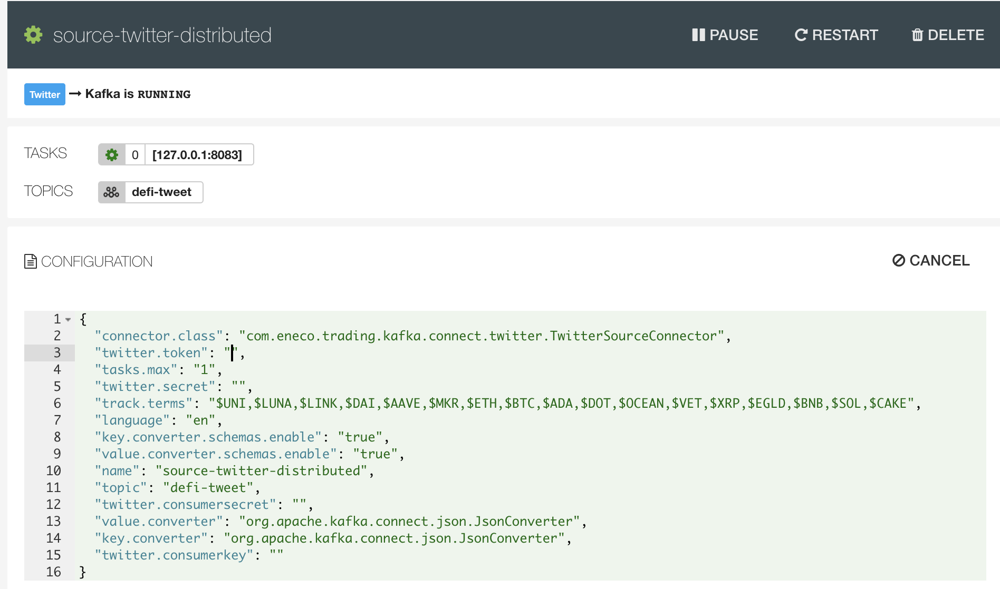

<!-- 
<p>
  <h1 align="center">Tweet Ingester backed by Kafka for Defi Projects on Polkadot's chain </h1>
</p> -->

**<h1>Tweet Ingester backed by Kafka for Defi Projects on Polkadot's chain</h2>**

- **[Polkadot](https://polkadot.network/)** has been gaining momentum amongst crypto community for long since 2016. Same as Ethereum, Polkadot empowers developeres to develop and deploy DApp on its ecosystem. What it differes from Ethereum is that Polkadot allows this through the creation of apps that communicate with other ledgers through a relay chain.

- With great interest in Polkadot, I would like to track and analyze tweets related Polkadot's Defi projects with the help kafka.

---

## Diagram


---
## Implementation


First of all, we need to boot up three microservices (kafka-cluster, elasticsearch & postgres) using docker-compose

```bash
docker-compose up kafka-cluster elasticsearch postgres
```

Before we plug in both source and sink connectors, we need to create kafka topic for parsed twitter stream

```bash
# go inside the kafka container 
docker exec it <kafka container id>
```

```bash
# create topics
kafka-topics --create --topic defi-tweet --partitions 3 --replication-factor 1 --zookeeper 127.0.0.1:2181
kafka-topics --create --topic above-10000-followers-tweets --partitions 3 --replication-factor 1 --zookeeper 127.0.0.1:2181
kafka-topics --create --topic fact-tweet --partitions 3 --replication-factor 1 --zookeeper 127.0.0.1:2181
kafka-topics --create --topic user-profile --partitions 3 --replication-factor 1 --zookeeper 127.0.0.1:2181

```


Then we check whether Landoop UI is running and exposed to port 3030 (as specified in docker-compose)

```bash
http://localhost:3030/
```


### Configure kafka connect 
#### Source - Twitter Connector
To plug in the open-sourced Twitter Kafka Source Connector using properties file at `./source/twitter-connector/source-twitter-distributed.properties` : 

```
name=source-twitter-distributed
connector.class=com.eneco.trading.kafka.connect.twitter.TwitterSourceConnector
tasks.max=1
topic=defi-tweet
key.converter=org.apache.kafka.connect.json.JsonConverter
key.converter.schemas.enable=true
value.converter=org.apache.kafka.connect.json.JsonConverter
value.converter.schemas.enable=true
twitter.consumerkey=< PLEASE FILL IN YOUR CREDENTIALS >
twitter.consumersecret=< PLEASE FILL IN YOUR CREDENTIALS >
twitter.token=< PLEASE FILL IN YOUR CREDENTIALS >
twitter.secret=< PLEASE FILL IN YOUR CREDENTIALS >
track.terms=$DOT,$LINK,$KSM,$ONT,$ZRX,$ANKR,$RENBTC,$REN,$OCEAN,$RLC,$EWT
language=en
```

- For twitter credentials parameters, you could look them up on twitter developer page in your own account. Whereas, <b>track.terms</b> specifies targeted keyword(s) you would like to track, with only comma as delimiter. 

- Recently, I am intrigued by tokens / defi projects on <b>Polkadot</b> chain, and thus I choose top 10 defi, by market cap, as tracking subject

- For quick demo, an open-sourced twitter kafka connect <b>com.eneco.trading.kafka.connect.twitter.TwitterSourceConnector</b> is used
(credit goes to : https://github.com/Eneco/kafka-connect-twitter)

-

Once you successfully wire up the twitter connector, it will be like this



#### Sink 1 - Elasticsearch

Just like adding the previous connector, twitter source, adding elasticsearch connector with config. in ```./sink/sink-elastic-defi-tweet-distributed.properties```

Then, you could visit home page of elasticsearch , with Deja vu frontend at 
```http://localhost:9200/```


For instance, I could do query on elasticsearch with ES query body. Say, I would like to keep an eye on tweets by accounts with more than 500 followers


Filtered results are like this


#### Sink 2 - Postgres

Other than ES, postgres also will be used as another sink.  

we could use JDBC sink connector with parameter specified in
```./sink/sink-postgres-defi-tweet-distributed.properties``` 

Let's jump into postgres container 

login postgres
```bash
    psql -U postgres
```

query the fields in targeted table sourced from kafka topic ```defi-tweet```

```bash
select created_at, text from public."defi-tweet" order by created_at desc;
```


---

When the above 1 source and 2 sink connectors are setup, Landoop UI will be like this

Topic page


Connect page


### kafka stream application

To run a jar that:

- produces a stream `above-10000-followers-tweets` that only includes fetected tweets with >= 10000 follower count from kafka topic `defi-tweet`
- splits a topic `above-10000-followers-tweets` into topic `user-profile` and `fact-tweet`

we compile a jar from `TweetFilter.java` under `./defi-tweet-stream` directory and build a jar 
```bash
mvn clean package
```

a jar will then be built


Since, in the docker-compose file, we mount the directory `./docker-mount` to directory `/app` in kafka broker container, we could simply copy that jar to that directory

```bash
cp defi-tweet-stream/target/defi-tweet-stream-1.0-SNAPSHOT-jar-with-dependencies.jar ./docker-mount
```

and run jar

```bash
java -jar /app/defi-tweet-stream-1.0-SNAPSHOT-jar-with-dependencies.jar
```

logs message and kafka stream app logs will be printed on terminal of that container


new three derived kafka topics are shown on Landoop UI, which consume their upstream topic(s)

That's the end of this code demo. Thank you :)


---


## What's Next?

### Make good use of real-time tweets streaming data on Polkadot to train ML pre-trained model.

:)